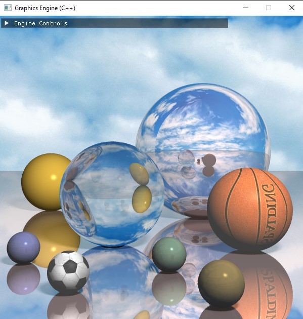
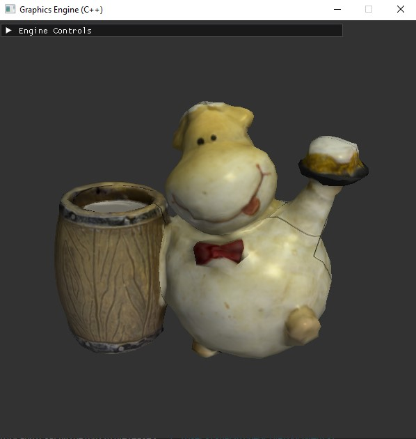
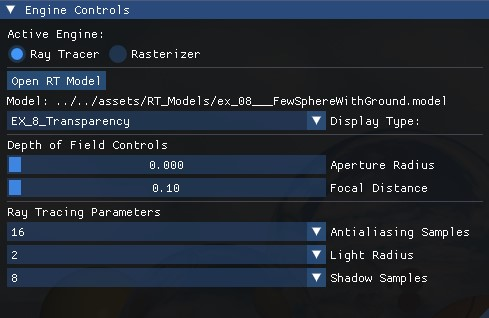
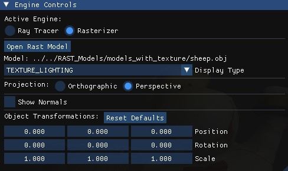
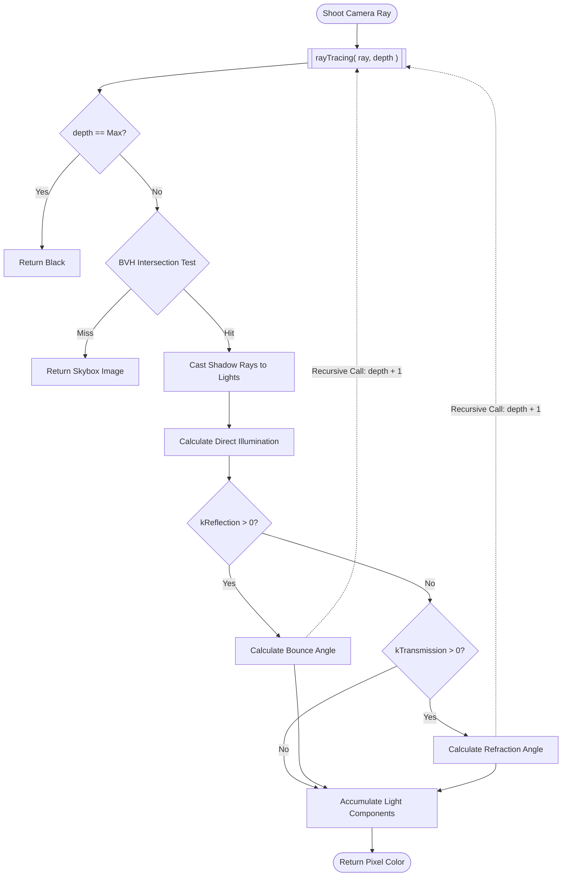

# Custom 3D Graphics Engine (Java to C++ Port)


## A CPU-based 3D graphics engine featuring both a Ray Tracer and a Polygon Rasterizer, built from scratch and heavily expanded.

This project is a C++ port of a basic Java university course project, built from scratch and heavily expanded. It serves as a comprehensive implementation of the core computer graphics pipeline, executing all mathematical transformations, geometric clipping, and pixel shading directly on the CPU without relying on hardware-accelerated APIs like OpenGL or DirectX. The dual-engine architecture demonstrates two fundamentally different approaches to 3D rendering: a recursive ray tracer focused on realistic light transport—handling reflections, refractions, and stochastic sampling—and a real-time software rasterizer that strictly follows the classic vertex-to-fragment pipeline.

## Table of Contents
* [Showcase](#showcase)
* [Engine Architecture & Pipelines](#engine-architecture--pipelines)
  * [The Ray Tracing Pipeline](#1-the-ray-tracing-pipeline)
  * [The Rasterization Pipeline](#2-the-rasterization-pipeline)
* [Engine Upgrades](#engine-upgrades)
* [Architecture & Dependencies](#architecture--dependencies)
* [Project Layout](#project-layout)
* [Building the Project](#building-the-project)
* [UI Controls](#ui-controls)


## Showcase

| | Ray Tracing | Rasterization |
| :---: | :---: | :---: |
| **Clean Render** |  |  |
| **UI Controls** |  |  |


## Engine Architecture & Pipelines

The engine features two distinct rendering pipelines, completely decoupled from the UI and windowing logic.

### 1. The Ray Tracing Pipeline
The Ray Tracer executes a physically-based approach to rendering. It shoots primary rays from the camera through a sub-pixel grid, utilizing a Bounding Volume Hierarchy (BVH) to rapidly filter out geometric misses. Upon intersection, it recursively calculates direct illumination, shadow occlusion, metallic reflections, and refractive transmissions using Snell's Law.



### 2. The Rasterization Pipeline
The Rasterizer executes a classic forward-rendering pipeline. It transforms 3D vertices into camera space, performs strict frustum clipping to generate new vertices for geometry crossing the screen edge, applies the perspective divide, and uses Barycentric coordinates to calculate precise pixel coverage, depth testing, and fragment interpolation.

```mermaid
flowchart TD
    A([Raw 3D Vertices]) --> B[Model, LookAt & Inverse-Transpose Normals Matrices]
    B --> C[Frustum Clipping & Back-Face Culling]
    C --> D[Perspective Divide & Viewport Mapping]
    
    D --> E[Barycentric Interpolation]
    E --> F{Z-Buffer Depth Test}
    
    F -->|Occluded| Discard([Discard Pixel])
    F -->|Visible| G[Sample Mipmap & Calculate Lighting]
    
    G --> H([Write to Framebuffer])
```




## Engine Upgrades

The port from Java to C++ served as the foundation for implementing advanced graphics concepts that go far beyond the scope of the original basic engine. The following features were explicitly engineered to upgrade both pipelines:

### Ray Tracing Enhancements

* **Multi-Threaded Rendering:** Bypassed single-threaded execution bottlenecks by distributing ray calculations across all available CPU cores using parallel execution policies.
* **Distribution Ray Tracing with BVH:** Implemented a Bounding Volume Hierarchy (BVH) spatial index to accelerate ray-object intersection testing, combined with stochastic distribution methods for complex light interactions.
* **Anti-Aliasing:** Integrated sub-pixel jittering to eliminate jagged geometric edges.
* **Soft Shadow Edges:** Implemented area-light sampling to calculate realistic penumbras and shadow falloffs.
* **Depth of Field:** Added lens sampling mathematics to simulate physical camera apertures and focal planes.

### Rasterization Enhancements

* **Geometry Clipping:** Implemented near/far viewing plane frustum clipping to dynamically slice triangles that cross the boundaries of the screen.
* **Face Culling:** Added back-face culling to immediately discard polygons facing away from the camera, saving pipeline calculations.
* **Normals Matrix Transformations:** Implemented the inverse-transpose normals matrix to ensure surface normals scale and rotate correctly in eye-space for accurate lighting calculations.
* **Mipmapping:** Integrated Level of Detail (LOD) texture filtering, utilizing screen-space coordinate derivatives to sample appropriately downscaled textures.
* **Z-Buffer with Transparency:** Upgraded the depth-buffering system to accurately track occlusion while handling transparent pixel sorting.


## Dependencies

By bypassing hardware-accelerated graphics APIs (like OpenGL or DirectX), this engine executes the entire rendering pipeline directly on the CPU. It relies on a minimal set of external C++ libraries for windowing, math, and asset parsing:

**Zero-Dependency Build:** This project utilizes CMake's `FetchContent` module to automatically download and link all required dependencies from source during the build generation phase. No manual library installation or package managers are required.

* **SDL2:** Framebuffer management, window creation, and input handling.
* **GLM:** Vector and matrix mathematics.
* **Dear ImGui:** Immediate-mode graphical user interface.
* **tinyobjloader:** Parsing '.obj' 3D model files.
* **stb_image:** Decoding image files (JPG, PNG, BMP) for texture mapping.
* **nlohmann/json:** Serializing and saving user UI preferences.


## Building the Project

* **Option 1: Pre-Built Executable**
[Download the pre-built Windows executable from the Releases tab](https://github.com/guyshargo/Graphics-Engine/releases).

* **Option 2: Build from Source**
This project uses CMake for cross-platform build generation. Because all external libraries are fetched automatically, the build process is entirely self-contained.

### Prerequisites
* CMake (v3.15 or higher)
* A C++17 compatible compiler
* Git (required for CMake to fetch dependencies)

### Build Steps
1. Clone the repository:
```bash
    git clone https://github.com/guyshargo/Graphics-Engine.git
    cd Graphics-Engine
```
2. Generate build files with CMake (this step will automatically download SDL2, GLM, and ImGui):
```bash
    mkdir build
    cd build
    cmake ..
```
3. Compile the engine:
```bash
    cmake --build . --config Release
```


## UI Controls

The engine features a comprehensive ImGui overlay for real-time parameter tuning and debugging.

### Global Controls
* **Engine Switch:** Toggle instantly between the Ray Tracer and Rasterizer pipelines.
* **File Loading:** Open native system file dialogs to load custom `.obj` (Rasterizer) or `.model` (Ray Tracer) assets.

### Ray Tracer Mode
* **Display Type:** Step through the mathematical stages of the pipeline (e.g., Rays Calculation, Rays Intersections, Texture, Reflections, Transparency).
* **Depth of Field:** Real-time sliders to adjust the simulated Aperture Radius and Focal Distance.
* **Sampling Parameters:** Dropdown menus to scale the processing load by adjusting Antialiasing Samples, Light Radius (for area lighting), and Soft Shadow Samples.

### Rasterizer Mode
* **Display Type:** Switch between rendering algorithms (e.g., Wireframe, Face Colors, Vertex Interpolation, Flat/Gouraud/Phong Shading, Textures).
* **Projection:** Toggle the camera projection matrix between Perspective and Orthographic.
* **Show Normals:** Render the calculated 3D surface normal vectors directly on the geometry.
* **Object Transformations:** Drag controls to dynamically translate, rotate, and scale the 3D model in world space.
* **Viewport Navigation (Mouse):**
    * **Left Click + Drag:** Orbit the camera around the look-at target.
    * **Right Click + Drag:** Pan the camera horizontally and vertically.
    * **Scroll Wheel:** Dolly (Zoom) the camera forward and backward.